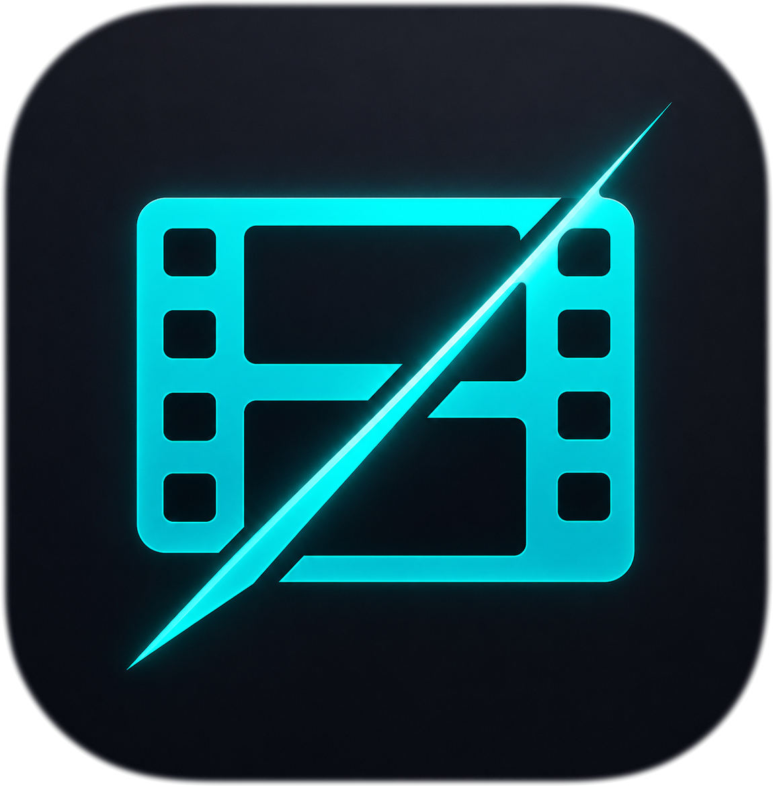
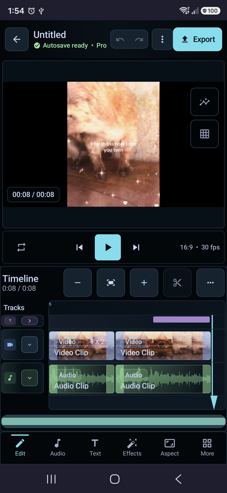

# Monstro V18 · motor completo ClearCut

Integração nativa do código ClearCut 3.81.0 (commit 8a18de40dd474bbc01f43fd5a6d8e1356ce5600f) com identidade `com.monstro.v18.studio`, uma Activity principal e uma timeline. Todo o código do motor, ferramentas, testes e dependências é versionado neste repositório. A importação reproduzível em `.integration/` só é usada uma vez durante a construção da branch; o aplicativo não baixa código-fonte em execução.

Os recursos do Monstro ficam em **Mais → Monstro FX / Gemini**: receitas Chaos/Studio, pacotes de FX, legendas Vosk/Gemini, Auto Edit, tradução, narração e conta. Prévia e exportação usam os mesmos efeitos. Os projetos antigos são convertidos em documentos do novo motor; seus arquivos, preferências e mídias originais são preservados. Revise a composição após a migração, pois os dois formatos usam convenções diferentes de velocidade, texto e posicionamento.

Android 8+ e OpenGL ES 3. Recursos com modelos opcionais ou serviços externos mantêm os requisitos e limites do ClearCut; ferramentas planejadas no upstream não se tornam implementadas por serem copiadas. Configuração Firebase e assinatura continuam pertencendo ao Monstro. A verificação de certificado de lançamento do ClearCut não se aplica a este fork.

## Documentação upstream preservada

<p align="center">
  
</p>

<h1 align="center">ClearCut</h1>

[](https://github.com/SysAdminDoc/ClearCut/releases)
[](LICENSE)


<p align="center">
  <a href="https://ko-fi.com/X8K126YVER">
    
  </a>
</p>

<p align="center">
  <sub><em>If ClearCut makes editing easier, a coffee helps fund the testing and maintenance behind each release.</em></sub>
</p>

### v3.81.0 Sharper screens, fewer dead ends

- The dashboard now keeps recent projects beside the built-in template library, with actions in the same flatter 12 dp layout.
- Export keeps three preset choices, editable output details, estimated size, and the main action visible on a phone screen.
- Settings keeps its navigation fixed and gives narrow rows room to wrap. Close stays visible in long privacy and license panels.
- Reversible project and clip deletion is immediate, while expanded visual checks cover 20 screens across both dark themes.
- Thermal export notices no longer claim the encoder paused or reduced work when it did not. Android 15 device thresholds and Android 16 headroom callbacks guide the advisory, forecast polling waits at least ten seconds, and shutdown cancellation is announced only after the engine stops.
- Stabilization, dependency versions, model requirements, and native-license details now come from current runtime and lock data. The local signed-release gate is verified, and completed Media3 plus artifact-gate blockers are retired.

### v3.80.0 A quieter workspace for every cut

- Stabilization now supports local, versioned `.ncstabilization` profiles that carry lens, motion-search, crop, and sync assumptions without executable content. Import previews disclose fallback metadata and stable rejection codes, activation is atomic, and the next offline analysis plus its saved project data use the selected profile.

### v3.79.0 A quieter workspace for every cut

- The dashboard now opens with a focused project launcher, a compact recent-project row, and direct access to built-in templates.
- The editor gives footage more room, keeps transport and timeline controls dense, and uses a flatter tool bar that stays readable at a glance.
- Settings uses compact rows and clearer value hierarchy without hiding ClearCut's existing controls.
- Export puts delivery facts, presets, editable output choices, and the export action in one visible path.
- Dark and high-contrast screenshot coverage now renders at a 360 x 800 dp phone viewport with accessibility checks enabled.
- Launcher shortcuts now open the new-project flow or the most recent project in every build variant, including streaming.
- Dependency freshness now tracks Activity and records an explicit adopt, hold, or retained-beta decision for every catalog pin. Accepted upgrades carry a passing QA, lint, assemble, and strict verification probe.
- HDR export now requires the selected encoder to report `FEATURE_HdrEditing` or `FEATURE_HlgEditing`; unsupported devices are stopped before render and the feature result is included in diagnostics.
- Subtitle filter paths now escape every FFmpeg filtergraph metacharacter before ASS/SSA burn-in.
- Audio tracks now expose signed, frame-grid clip sync offsets that persist through autosave and edit-decision JSON and feed the shared preview, export, mixdown, and stem timing path.
- Clip sync offsets at the signed limit now stay on the nearest in-bounds frame boundary for fractional frame rates.
- Translation contributors now have a documented locale, resource-parity, locale-config, and Play metadata path, with a recursive UI literal ratchet and locale registration test.
- Timeline toolbar rendering now has its own callback-driven owner and zoom policy, with focused behavior coverage and reviewed byte budgets for the largest editor coordination files.
- Shareable effect and style packs now publish a schema-v3 compatibility manifest with minimum app version, required capabilities, payload hashes, provenance, and stable import reason codes. Unknown capabilities and incompatible app versions are rejected before any install, while legacy packs still migrate through the rollback-safe path.
- Translation coverage now walks every `values-*` resource directory, checks strings, plurals, and arrays against English, parses locale registration, and requires the matching Play metadata files. Dependency freshness applies the fixed 30-day horizon to snapshot, dependency, and upstream fact evidence, while the timeline toolbar keeps one overflow owner and one shared zoom clamp across fit, pinch, and ViewModel updates.

### v3.78.1 CFR delivery and source-cut batch exports

- Distribution metadata now includes a translated Spanish listing and current changelog; Play screenshots are derived from checked-in API 37 device captures and the release helper scripts work from a clean checkout.
- Project persistence now runs on Room 3.0.1 and SQLite driver APIs, with the full v1 to v10 migration chain validated on the API 37 device lane.
- Pure single-source MP4 trims use Media3's GOP optimization when eligible, and the export sheet explains whether smart trim or a full render was chosen and why.
- CFR export normalization now turns irregular VFR source cadence into the selected delivery rate before the final Media3 render.
- Batch Export can queue independent source-file trim ranges with persisted URIs and per-item settings while retaining uniform project exports.

### v3.78.0 Nothing reports work that did not happen

- **The editor walkthrough is explicit.** New editor sessions no longer interrupt work with an automatic tutorial; Settings → Replay Editor Walkthrough opens it immediately in the latest project (or a blank editor when no project exists), and Back/Skip return cleanly without a persisted reset flag.
- **Auto Captions stop inventing words.** Without a transcription model the fallback measured *when* speech happened and filled the gap with "[Speech segment N]": text that was saved to your project, drawn in the preview, burned into the exported video and written to the SRT, under a toast saying captions had been added. The timing is real, so it is now marked on the timeline; the missing transcript is stated outright.
- **The copyright check stops clearing audio it never checked.** The content-ID pre-check does not contact AcoustID, and reported "No copyright match detected" anyway. It now distinguishes *looked up and found nothing* from *never looked up*, and says which.
- **A partial project restore no longer overwrites itself.** Deserialization dropped malformed clips, tracks, effects, keyframes, masks, overlays, markers and media assets to the log; the project opened looking whole and the next autosave wrote the truncation back over the only file that still had them. Recovery reads now leave Room and every autosave artifact untouched, including diagnostic exports. Your choice is committed once across both stores, and saving resumes only after it succeeds.
- **Export failures say what failed.** Seven distinct terminal causes: encoder error, zero-byte output, failed verification, ten-minute stall, service timeout, storage refusal, audio and subtitle failures: collapsed into one "export failed" sentence. Each now has its own message and a remediation line, and the error card offers Copy report.
- **Every Settings control changes something.** Nine settings persisted, rendered their saved value back, and were read by nothing: haptics, thumbnail cache size, default track height, default aspect ratio and codec, proxy resolution, and the AcoustID key. Appearance "System" is gone: only dark schemes exist, so it read the platform preference and resolved to Dark either way.
- **AI tools stop reporting failures as good news.** A crashed transcription reported "No speech detected"; a failed motion analysis reported "Video is already stable"; a static zoom with no counter-motion reported "Basic stabilization applied". Each now separates *analysed and found nothing* from *could not analyse*, and the zoom is called what it is: a crop. A disclosure sidecar that fails to write is no longer silent.
- **Deleting is recoverable again.** Snapshot deletion has an explicit restore offer separate from timeline undo, the AI usage ledger remains undoable, and user templates go to a trash you can restore from.
- **Every project store now shares one document boundary.** Autosave, archives, templates, new-project creation, recovery, snapshots and timeline interchange use a versioned project envelope that preserves metadata, reports unknown fields, rejects future schemas and keeps metadata-only saves from being skipped.
- **Mixer edits now survive the whole render path.** Track pan, clip/track DSP chains, volume envelopes and normalization run through the same PCM processors in preview, video export, audio mixdown and stems; mono sources are expanded to honor a saved pan instead of dropping it.
- **The dashboard stops flashing "No projects yet"** before your projects load, opening a project that no longer exists reports it instead of creating a blank one in its place, and batch media import counts files off as it goes.
- The AI requirement sheet's Run button no longer re-opens itself. The release signing certificate is pinned and the build refuses to fall back to the debug key.

### v3.77.0 Truthful exports, per-ABI downloads, and redacted diagnostics

- **Downloads are about a quarter of the size.** Per-ABI APKs are now published alongside the universal build: the arm64-v8a release is 92 MB instead of 349 MB, and the app bundle produces 46.5 to 55.0 MB compressed per-device sets. Every ABI is checksum- and certificate-verified, 16 KB-aligned, and install-tested.
- **Exports stop before they lie.** Preflight warnings are itemized and shown before any work starts, and the export waits for you to accept them; accepting is recorded in export history. A reversed clip whose backend is unavailable or which exceeds the reverse limit is disclosed up front instead of quietly exporting forward, and an unexpected reverse failure now stops the export naming the clip and stage. Audio that will be resampled is disclosed too.
- **Noise reduction reports what actually happened.** Analysis measures the audio instead of assuming 20 dB SNR, and results distinguish applied, no-op, unavailable, and failed. A run that cannot improve the audio no longer replaces your clip with a copy and claims an SNR gain, and the spectral-gate backend is now actually wired up.
- **Previewing a style pack no longer installs it.** Validation and installation are separate; confirming dispatches by document kind instead of routing everything through the template importer.
- **Project saves are atomic.** The project row and its media manifest are written in one transaction, closing a window where a crash could leave a project with an erased media list.
- **Trash stays reachable.** Deleting your last project no longer hides Restore behind an empty state, and the confirmation says what deleting actually does: it is a 30-day restorable soft delete.
- **Android's system backup fits again.** ClearCut's share of Android Auto Backup is bounded to project documents, because that quota is 25 MB and all-or-nothing: one big render was silently failing the entire backup. Generated media and app-owned custom fonts/LUTs travel by device-to-device transfer or an Archive Transfer you export; partial files and external URI-backed watermark/media references remain explicit relink work.
- **Logs no longer print your file names.** Every log site that names an asset now emits a stable digest, and export failures produce a copyable report naming stage, codec, device, clip, and what to try.
- Privacy dashboard rows only offer actions that run, and say where the control lives otherwise. Published privacy policy and Data safety worksheet are live and tracked. Transitive protobuf constrained above GHSA-735f-pc8j-v9w8, Gradle wrapper checksum pinned, and the release gate now reads the resolved dependency graph.

### v3.76.0 One UI 8.5 interface hardening and first-run tutorial restored

- The first-run tips wizard auto-shows again on a fresh install: the auto-show call was lost in an earlier menu-chrome refactor, which also made Settings > Reset tutorial a no-op. (#49)
- The tutorial overlay's touch scrim no longer competes with its own Next/Skip/Back buttons for pointer events; the consume-everything handler moved from the shared root container to a back-most sibling layer, so the buttons now have exclusive claim to their touches on every input pipeline. (#49)
- AndroidX input/navigation stack refreshed (activity 1.10.1, core-ktx 1.19.0, navigation 2.9.8) for Android 16 / One UI compatibility fixes.

### v3.75.1 Export truthfulness and safer font import

- Custom font import is bounded and atomic: only validated `.ttf`/`.otf` files install, the copy is capped at 48 MB, and the file is verified as a real typeface and fsync'd before an atomic move: a failed or partial import can no longer land as a broken font.

### v3.75.0 Track-verified audio-only and stem exports

- Audio-only and stem exports now produce real standalone `.m4a` (`audio/mp4`) files with no video track, instead of silently emitting a video file or failing on a picture-less timeline. Audio-only mixes every audible track (including video-embedded audio) into one AAC file; stems write one deterministic `.m4a` per audible timeline track. Standalone audio saves through `MediaStore.Audio`, and the output verifier now confirms an audio track is present and that no video track leaked. Opus/FLAC fail before any encoder work starts rather than falling back to video.

### v3.74.157 Deep audit: export integrity, gestures, and data safety

- Managed-media garbage collection no longer deletes live projects' imported clips: the reference scan un-escapes on-device JSON URIs (Android escaped `/`), scans crash-window `.bak` recovery files, and sweeps stranded archive-import directories; trash purge now clears purged projects' recovery data.
- Exports are honest again: timeline gaps no longer vanish from stream-copy/mixed-render output, Android 14 exports no longer crash at start, audio-less reverse clips render reversed instead of silently forward, and the export watchdog only cancels a genuine hang rather than any export over ten minutes.
- Editor curve/keyframe/mask handles are draggable again (they died after one frame), speed-curve and color-grade drags capture a single undo entry and one save instead of thousands, and snapshots/backup imports restore global transitions and the AI ledger.
- Audio analysis math corrected: beat detection and multicam sync read the real sample rate, AI decode loops are memory-bounded, and the recommended noise gate no longer chops speech.

### v3.74.156 Single-source release identity

- Gradle version metadata is now the only runtime release-version source; Settings/About continues to derive its label from `BuildConfig.VERSION_NAME`.
- Local release verification ignores gitignored planning Markdown and rejects any reintroduced `app_version` resource duplicate through a fixture-backed self-test.

### v3.74.155 Storage-safe project archives

- Incoming `.clearcut` previews now read bounded project/manifest metadata without extracting media.
- Intentional imports preflight compressed, expanded, per-entry, compression-ratio, and free-space limits, then install from a sibling staging directory so rejection or cancellation leaves no partial project.

### v3.74.152 Slip crash and NTSC timecode fixes

- Slipping a clip whose source is shorter than 100 ms no longer crashes; the slip window is clamped to the source and the trim end stays within it.
- Timecode for fractional rates (29.97/59.94) now tracks wall-clock time instead of drifting ~3.6 s per hour from counting frames at a rounded 30 fps.

### v3.74.151 Gap-preserving reorder and synced duplicate

- Reordering a clip within a track now preserves intentional gaps and the track's overall span instead of re-packing everything gaplessly.
- Duplicating a linked video/audio pair shifts every affected track by one uniform ripple offset, so pairs with different durations no longer drift out of sync.

### v3.74.150 Deep audit hardening

- **Security:** untrusted style-pack ids are sanitized before touching the filesystem (path-traversal fix); model downloads follow redirects manually and re-validate HTTPS on every hop; imported color values are masked to 32-bit ARGB.
- **Privacy:** the metadata scrubber strips a far wider set of GPS/device/timestamp EXIF tags, rewrites WebP pixels without metadata, and uses the bundled FFmpeg TIFF re-encode path instead of silently passing through WebP/TIFF metadata.
- **Correctness:** GIF export no longer recycles cached thumbnail bitmaps (a crash on the next thumbnail/export); adjacent clips only merge when their speed, reverse, volume, and speed-curve match; imported `.ncfx` LUT references that don't exist are dropped instead of colliding with another project's LUT.

### v3.74.149 Faster noise analysis

- AI noise-profile analysis now uses an O(n log n) radix-2 FFT instead of the previous O(n²) DFT, collapsing ~8.4M trig operations to a few tens of thousands so the analysis completes far faster and cancels promptly.

### v3.74.148 Resilient project deserialization

- A single corrupt caption word or text-path point in a saved project is now skipped individually instead of dropping the whole caption or text overlay. Mask polygons intentionally keep whole-mask drop, since a partial polygon renders a wrong shape.

### v3.74.147 No click on non-frame-aligned audio

- Reverb, delay, chorus, and flanger now pass the trailing partial frame through dry instead of leaving it zeroed, so a PCM buffer whose length is not a multiple of the channel count no longer ends on a brief click.

### v3.74.146 Correct cross-orientation reframe pan

- Smart Reframe now derives horizontal and vertical pan limits independently, so a 16:9→9:16 (or 9:16→16:9) reframe can track the subject on the axis with real headroom instead of applying a symmetric clamp that both over-restricted one axis and allowed motion on the axis that fills the frame.

### v3.74.145 Cancellable, bounded audio decode

- Audio decode loops (waveform, PCM, multi-cam sync, Whisper transcription) now check cooperative cancellation each iteration, so closing a project or cancelling a job stops the decoder promptly.
- Added `AudioDecodeBudget` so a long or crafted track can no longer accumulate hundreds of MB of PCM; decode fails closed at the budget instead of OOMing.

### v3.74.144 Bounded duration analysis

- Added `MediaDurationPolicy` so hostile or malformed duration metadata (negative, `Long.MAX_VALUE`, conversion-overflow, or over-24-hour) can no longer size an analysis array or drive an unbounded frame-sampling loop.
- Flash-safety, scene detection, auto-color, and smart-reframe analysis now clamp their sample counts and skip proportional work for implausible durations, with cooperative cancellation added to the flash scan.

### v3.74.143 Model-gated caption translation

- Caption translation now requires an installed translation model and no longer returns the source text labeled as a translation; without one, the panel shows an explicit "translation model required" state instead of untranslated rows.
- `CaptionTranslationEngine.translate()` fails fast with `TranslationUnavailableException` while stubbed, and the editor guards both translate and per-row regenerate paths.

### v3.74.142 Smart Reframe model repair

- Repinned the BlazeFace face-detector model to its generation-locked URL, exact 229,746-byte ceiling, and correct SHA-256, so Smart Reframe can reach a verified ready state instead of failing the byte/checksum guard.
- Added the model to the `docs/models.md` registry and changed the registry coverage test to discover every runtime `ModelFile` download spec, so any new engine that skips checksum verification fails the build.

### v3.74.141 Consent-gated MediaPipe

- On-device MediaPipe tasks (selfie segmentation, Smart Reframe) are now gated by explicit, versioned consent. No `ImageSegmenter`/`FaceDetector` is constructed before the user opts in from Settings → AI Models.
- Revoking consent closes any running task and blocks it from starting again until re-consent; all non-MediaPipe editing stays fully usable when denied.
- The privacy dashboard, policy, and Play Data safety worksheet now disclose that the MediaPipe SDK sends anonymous performance metrics to Google via Play Services DataTransport while input media stays on-device. A source-scan test proves every Tasks constructor call site is gated.

### v3.74.140 Trustworthy saved-state tracking

- The editor now compares a canonical document fingerprint with the latest completed save, so new edits show as unsaved and undoing exactly to the saved baseline clears the modified state.
- Manual and periodic saves carry ordered snapshot tokens; edits made during a save and stale success/failure callbacks can no longer be mislabeled as current persistence.
- Autosave errors remain visible until a successful retry. Fingerprints ignore timestamps, playhead position, proxy paths, media verification refreshes, and map/set iteration order while retaining every persisted edit domain.
- Undo snapshots now restore global transitions, storyboard cards, and transcripts, allowing those edits to return to the same clean baseline.

### v3.74.139 Frame-quantized timeline edits

- Project timing now uses a persisted rational timebase with deterministic NTSC frame conversion; new splits, trims, slips, slides, ripple deletes, markers, chapters, and explicit seeks resolve on project-frame boundaries.
- Linked edits carry frame deltas instead of rounded millisecond deltas, preventing 29.97 fps drift such as 67 ms becoming 66 ms after a ripple or linked positions shifting to 134 ms instead of 133 ms.
- Preview and project cards show resolved frame-rate/timecode labels. Room schema 9 and template interchange preserve the rational timebase while leaving legacy timeline data unchanged until edited.

### v3.74.138 Transactional timeline gestures

- Trim, slip, and slide now capture their pre-edit undo snapshot only before the first effective timing change, keeping undo and redo byte-for-byte unchanged for taps, clamped drags, and other no-ops.
- Pointer cancellation restores the pre-gesture tracks, selection, and playhead without committing history; a drag that returns to its original timing also adds no undo entry.
- Successful gestures still commit exactly one history entry at gesture end, clear redo only then, and rebuild/persist once. Timing-signature comparisons avoid Android `Uri` equality affecting no-op detection.

### v3.74.137 Live extended-trim preview

- Dragging either trim edge now keeps direct seeks for retained media and throttles composition refreshes only when the gesture exposes media outside the range prepared at gesture start.
- Pending trim refreshes are canceled before the final gesture rebuild, while an immutable prepared-range snapshot keeps extend/retract/re-extend sequences correct without rebuilding on every pointer event.
- Media3 preview items now declare original source duration before clipping, fixing non-zero trim starts that were rejected before decode. A physical-device two-color H.264 fixture verifies both the trimmed and newly exposed boundary frames.
- A clean lint rebuild reproduced the same Kotlin analysis API crash in `UnrememberedMutableState`; it joins the exact per-detector workaround/probe set until the pinned analysis stack changes.

### v3.74.136 Multi-track live composition

- Live preview now uses Media3 `CompositionPlayer` with one synchronized composition for every visible video/overlay lane and every audible dedicated audio lane.
- Preview and export share persisted track ordering, absolute sequence gaps, mute/solo/volume policy, linked-audio suppression, clip speed, fades, and volume automation; composition rebuilds preserve the playhead and requested playback state.
- Missing upper layers become transparent sequence gaps instead of black frames that hide lower video. Proxy resolution, preview-safe effects, adjustment layers, and color-blind simulation remain in the composition graph.
- Physical-device offscreen integration proves two simultaneous visual sequences composite with the expected z-order/opacity, seek together, and accept a gap-only replacement graph; pure tests cover overlap ordering, gaps, visibility, mute, solo, gain, and sampled speed changes.
- Clean lint analysis proved `RememberInComposition`, `AutoboxingStateCreation`, and `UnrememberedMutableState` crash against the pinned Kotlin analysis API; all remain in the exact re-probeable workaround set.

### v3.74.135 Shaped CJK and RTL captions

- Caption preview keeps highlighted Arabic/mixed text in one bidi-shaped paragraph, resolves CJK/Arabic system fallback families, and reveals typewriter text only at grapheme boundaries.
- ASS burn-in now preserves Unicode and caption styling with per-script Noto families from Android system fonts; requested burn-in failures stop the export instead of silently shipping an uncaptioned video.
- Media3 text overlays use glyph-aware fallback, while stroked overlays use `StaticLayout` for shaping, bidi, wrapping, and bounds. JVM/native-graphics fixtures cover CJK, Japanese, Korean, Arabic, mixed direction, supplementary RTL, combining marks, and emoji ZWJ sequences.

### v3.74.134 Complete semantic feature theming

- Editor, export, and media-picker features no longer read raw palette tokens: structural text/panels/surfaces/strokes/indicators now follow the active semantic palette, while category identity uses one audited accent contract.
- High Contrast Dark now reaches custom timeline, preview, curve, mask, mixer, scope, and transform surfaces; contrast tests cover every semantic elevation and category accent, and a source ratchet prevents raw-token regressions.
- Added an instrumentation render smoke for High Contrast Dark across phone editor/media/export and forced desktop editor/export, with accessibility checks and captured roots at both layouts.

### v3.74.133 Narrow lint workarounds

- Independently re-tested every disabled Compose/lifecycle source detector and restored `RememberInComposition`, `AutoboxingStateCreation`, and `UnrememberedMutableState` across main, unit-test, and Android-test analysis.
- The three remaining binary-incompatible detectors have exact current failure evidence, an opt-in per-detector Gradle probe, and a dependency-version ratchet that forces review after AGP, Kotlin, Compose, or lifecycle upgrades.

### v3.74.132 Locale and accessibility parity

- English and Spanish resource keys, plural quantities, and format placeholders now have a strict parity ratchet; the export, timeline, speed-curve, and mask surfaces no longer expose reachable English-only copy or enum labels.
- Debug builds generate and register expanded en-XA and RTL ar-XB pseudo-locales, with an instrumentation smoke that renders the critical export flow, runs accessibility checks, captures both layouts, and verifies RTL direction.
- Mask toggles now present one switch action with a localized state description, while export column choices use locale-aware plurals.

### v3.74.131 Minimal normal-build permissions

- Normal debug/release APKs no longer declare dormant Nearby or local-network permissions, and the streaming engine is compile-time disabled even if an incidental backend class appears.
- A side-by-side `streaming` preview variant alone carries the future Android 16/17 permission/rationale contract; merged-manifest, policy, privacy, and Play-listing validators lock the split.

### v3.74.130 Storage-safe exports

- Every export checks destination and scratch capacity before dispatch, then checks again immediately before stream copy, each Transformer run, mixed concat, and frame capture.
- The planner merges same-volume demand, accounts for retained reverse/mixed/burn files and complete batches, blocks unbounded sizes, and reports localized required/available values with smaller alternatives.

### v3.74.129 Reproducible native video stack

- Replaced the obsolete binary fork with a source-pinned LGPL-3.0-or-later FFmpegKitNext 8.1.0 / FFmpeg 8.1.2 build across five Android targets; AVI processing is restored on the fixed decoder and the advisory-covered native formats are explicitly refused.
- Release preflight verifies the vendored AAR, exact source/build lock, security patch, and complete advisory inventory, then emits deterministic CycloneDX 1.6 and SPDX 2.3 native inventories.

### v3.74.128 Bounded model downloads

- Every downloadable model now declares a hard byte ceiling in addition to its minimum, estimate, and checksum.
- Oversized declared lengths fail before body reads; chunked or lying responses abort before writing past the cap, delete partial files, preserve storage headroom, and keep progress bounded.

### v3.74.127 Portable projects and review-first Auto Edit

- `.clearcut` archives now carry a typed v2 dependency manifest with safe paths, byte lengths, SHA-256 integrity, LUT/custom-font/watermark packaging, verified import rewrites, tamper rejection, and v1 compatibility.
- Auto Edit scores bounded windows throughout each source and exposes deterministic Highlight, Source Order, and Beat Sync proposals for review; generation and cancellation are non-mutating, while Apply is one undoable edit with stale-source protection.
- Android 16 strict intent matching now rejects null or mismatched explicit intents while preserving launcher, shortcut, VIEW, SEND, and SEND_MULTIPLE entry points.

### v3.74.126 Dependency-truthful export preflight

- Export now resolves one typed dependency manifest before every render path, recursively covering timeline media, compound clips, LUTs, custom fonts, configured watermarks, and the background-removal model.
- Missing, unreadable, or invalid requested dependencies block before output work starts and are named in the error; a substitution can proceed only when an explicit fallback and its name are recorded.
- Added deterministic collector/probe and combined media/audio/dependency preflight tests. Storyboard-only assets remain portable without blocking timeline export.

### v3.74.125 Private diagnostic sharing

- Diagnostic ZIPs now group export incidents with bundle-scoped project pseudonyms and structured failure/configuration counts only.
- Project names and IDs, media paths, free-form error text, health summaries, captions, and transcripts remain available only in private on-device incident history and never enter the shared ZIP.
- Hostile-string regression coverage scans every generated ZIP entry, and dependency verification now trusts the independently verified JUnit 5.9.2 module metadata used by clean test builds.

### v3.74.120 Editor workspace and playback

- Replaced oversized multi-row tool cards with a compact action rail; Color and FX now open their real editors directly, and tool panels use title-only headers without training copy.
- Removed automatic tutorials and editing-suggestion banners from the editing workspace so the preview, timeline, and commands remain uninterrupted.
- Added a persistent Text lane above video for new and restored projects. Text spans render on the lane, tap to edit, and empty lane space opens a new title.
- Compact phone timelines use tighter chrome, shorter rulers, concise track labels, and a collapsed Text lane to return vertical room to the video preview.
- Paused Media3 sessions stuck in `BUFFERING` now restart before Play, and the preview no longer shows a permanent loading spinner when playback was not requested.
- The project home now opens directly on compact create/import, search, filters, and recent work instead of a marketing/training hero.
- Playback completion retains the final decoded frame instead of misclassifying the exact timeline end as an empty gap.

### v3.74.119 Timeline edit controls and playback

- The video preview now owns all flexible phone height; the bounded timeline and tool dock stay together at the bottom instead of leaving a large empty timeline panel.
- Cut works directly at the live playhead, selected clips expose an obvious red Delete button, playlist rebuilds start atomically at the active edit point, ripple deletes keep playback attached to surviving content, and Play restarts after reaching the edited timeline end.
- Autosaves restore silently without interrupting editing with a confirmation popup.
- Autosave status now changes to Saved only after the file write succeeds; failed periodic, immediate, or database writes remain visible as an inline error without a popup.
- Release signing now resolves both property and environment keystore paths from the repository root, preventing a valid root-level keystore from silently producing a debug-signed APK.
- Editing suggestions now offer “Not now” and remain snoozed for 30 minutes instead of reappearing on each clip selection.
- Manual cuts keep the prepared Media3 timeline intact, stored player listeners attach during lazy player creation, and Play re-seeks/restarts correctly after cuts and timeline end.
- Merging adjacent cuts keeps every later clip at its existing timeline position instead of shifting the rest of the track backward into an overlap.
- Playback intent now remains distinct from decoded-frame progress, so buffering after a cut shows Pause and cannot turn a visible Play tap into an accidental cancellation.
- Ended or stalled preview sessions reset their media period and decoder at the active timeline position, with an automatic one-shot recovery when playback does not begin promptly.
- Saved transitions remain active for export, while the live preview uses stable cuts instead of unsafe single-input transition shaders that could leave Media3 on a black frame after rewind.
- Effect safety now includes true alpha opacity, wired chroma spill, tail-aware nonlinear transition timing, corrected gamma/highlight/shadow/posterize math, and guarded GPU edge cases; unsupported generic Speed/Reverse/BG Removal entries are no longer offered as no-op effects.
- Easy mode now maps to the current editor tabs, the More workbench exposes rendered motion tools, clip-only captions are no longer offered without a clip, and the command palette routes background replacement, face tracking, and model-gated frame interpolation correctly.
- Incomplete mask/blend compositing remains withheld from the editor instead of accepting edits that preview or export cannot honor.
- The preview PlayerView remains mounted across timeline gaps, still images, and error overlays, preventing Samsung/Qualcomm surface-detach timeouts from being mislabeled as clip decoder failures.
- Playback recovery now verifies actual timeline movement instead of trusting Media3's `isPlaying` flag; a stuck-player signal at the timeline end is handled as normal completion rather than a decode error.
- Adjacent plain cuts from the same source are coalesced only in the Media3 preview playlist, preventing a hardware-decoder restart at the cut while keeping the timeline clips independently editable.

<p align="center">A professional Android video editor built with Kotlin and Jetpack Compose.<br>Open alternative to CapCut, PowerDirector, and DaVinci Resolve: with AI-assisted tools, GPU-accelerated effects, and desktop NLE interoperability.</p>


Release history is maintained in git tags and the development checkout's local
`CHANGELOG.md`.

## Premium mobile workspace

The phone-first editing workspace keeps the footage, frame transport, and
multi-track timeline in one continuous AMOLED editing deck. Saved state stays
with the project identity, track controls remain compact, and a six-category
tool dock keeps advanced actions available without turning the canvas into a
dashboard.

<p align="center">
  
</p>

## Project planning

Planning files are local-only in the development checkout:

- `ROADMAP.md` is the only source of truth for incomplete actionable work.
- `Roadmap_Blocked.md` records blocked or operator-gated work until it can be
  implemented locally.
- `RESEARCH.md` stores consolidated product, platform, and ecosystem research.
- Shipped work lives in git history and the local `CHANGELOG.md`.

## Features

### Languages
- English and Spanish (`es`) are available through Android 13+ per-app language settings.

### Timeline Editing
- Multi-track timeline with video, audio, overlay, text, and adjustment layers
- Trim, split, merge, crop, rotate with visual handles; numeric trim commits as one undoable edit
- **Reliable split ownership**: linked/grouped cuts preserve side-specific grouping, rebase animation/effect/mask/caption timing, renew nested IDs, and retain waveform/tracking context
- **Gap-safe linked ripple delete**: single and multi-delete share one locked-track-aware planner that expands linked/grouped clips without compacting unrelated tracks or intentional gaps
- **Retimed live preview**: constant-speed and ramped clips seek to the correct source frame, keep the playhead aligned, and refresh speed/volume immediately across cuts
- **WYSIWYG overlays and recovery**: titles, stickers, and images stay visible across timeline gaps; decoder failures offer a direct Media Manager recovery path
- **Local metadata sidecars**: Media Manager detects embedded subtitle/GPS-like tracks, exports text subtitles as VTT/SRT and NMEA/container locations as GPX/CSV, and explains unsupported telemetry without network access
- **Slip/slide editing**: drag clip body to slide (reposition) or slip (shift source window)
- **Magnetic snapping**: clips snap to edges, playhead, and markers (8dp threshold with diamond indicators)
- **Clip grouping**: select multiple clips, group/ungroup, move as a unit
- Speed control (0.1x-16x) with bezier speed ramping curves and presets
- Keyframe animation for position, scale, rotation, opacity, volume with **12 easing types** (linear, ease in/out, spring, bounce, elastic, back, circular, expo, sine, cubic)
- **14 speed presets** including time freeze, film reel, heartbeat, crescendo
- Undo/redo (50 levels) restores clip selection/playhead context and persists immediately
- Long-press multi-select for batch operations
- Pinch-to-zoom + zoom in/out/fit buttons
- Timeline scrubbing with frame-accurate seeking
- **Colored timeline markers**: 6 colors (red/orange/yellow/green/blue/purple) with labels, notes, and jump navigation
- **Sticker/GIF/image overlays**: position, scale, rotate, opacity with timeline placement
- **Favorites & recent effects**: mark effects as favorites, track recently used for quick access
- **Multi-cam sync**: audio-based clip synchronization across tracks
- **Clip reorder & move**: reorder clips within a track or move between tracks
- **Haptic feedback**: tactile response on trim handle grab and magnetic snap
- **Waveform caching**: LRU cache avoids redundant audio decoding on timeline recomposition
- **Clip color labels**: 7 Catppuccin colors (red, peach, green, blue, mauve, yellow, none) with colored top border on Timeline
- **Track collapse/expand**: Per-track chevron + collapse/expand all toggle, collapsed tracks show thin 24dp colored bars
- **Track height cycling**: Long-press track type icon to cycle 48→64→80→96dp
- **Keyboard shortcuts**: Space, Ctrl+Z/Y, arrow keys, M, S, +/-, Delete, Ctrl+S, Ctrl+C/V for external keyboard editing
- **Snap-to-beat/marker**: Beat markers and timeline markers as additional snap targets (settings-driven)
- **Marker list panel**: Searchable, filterable marker list with color chips, inline label editing, jump-to-time

### Effects & Transitions
- **37 GPU-accelerated GLSL transitions** with unique Material icons per type: dissolve, wipe, zoom, spin, flip, cube, ripple, pixelate, morph, glitch, swirl, heart, dreamy, plus 12 new: door open, burn, radial wipe, mosaic reveal, bounce, lens flare, page curl, cross warp, angular, kaleidoscope, squares wire, color phase
- **40+ video effects**: brightness, contrast, saturation, hue, sharpen, vignette, mosaic, fisheye, wave, chromatic aberration, radial blur, motion blur, tilt shift
- **Film grain**: perceptual-aware (more in shadows, less in highlights), animated blue noise pattern
- **VHS/Retro**: scanlines, chroma bleeding, tracking distortion, posterized color depth
- **Glitch**: RGB channel splitting, 8x8 block corruption, horizontal line displacement
- **Light leak**: procedural animated warm gradient with screen blend mode
- **9-tap Gaussian blur**: separable kernel with proper sigma-based weights
- 18 blend modes (normal, multiply, screen, overlay, soft light, hard light, difference, exclusion, etc.)
- Freehand/rectangle/ellipse/gradient masks with feather, expansion, and motion tracking
- **Professional chroma key**: YCbCr color space keying with smoothstep feathering and green/blue spill suppression

### Color Grading
- Lift/gamma/gain color wheels with continuous control
- RGB curves and HSL qualifier
- **LUT import** (.cube/.3dl) with file picker and intensity control
- **Color matching**: per-channel gamma correction between reference and target clips
- **Video scopes**: histogram, waveform, vectorscope with animated overlay (GPU compute shader ready for ES 3.1+)

### Audio
- Full audio mixer with per-track volume faders, **pan slider**, mute/solo, **smoothed VU meters** (ballistic attack/decay)
- 15 DSP effects: parametric EQ, compressor (corrected attack/release), limiter, delay, chorus, de-esser, pitch shift, noise gate
- Waveform visualization with fade envelope overlay
- **Beat detection**: spectral flux onset detection with adaptive thresholding and BPM estimation (aubio NDK ready)
- **Auto-duck**: speech-aware volume keyframing (analyzes voice track, creates keyframes on music track)
- **EBU R128 loudness normalization**: K-weighted measurement with 6 platform presets:
 : YouTube/Spotify (-14 LUFS), TikTok (-14 LUFS), Podcast/Apple (-16 LUFS), Broadcast EBU R128 (-23 LUFS), Cinema (-24 LUFS), Loud (-9 LUFS)
- True-peak limiting to prevent clipping
- Voiceover recording with automatic timeline placement
- **Fade overlap protection**: fade in + fade out constrained to clip duration
- **Noise reduction**: DeepFilterNet 3 (bundled AAR, checksum-pinned) with a spectral-gate fallback; 5 modes (off/light/moderate/aggressive/spectral gate). Reports applied / no-op / unavailable / failed rather than assuming success

### AI Tools
<!-- capability-registry:ai-tools:begin -->
| Tool | Engine | On-Device? |
|------|--------|------------|
| **Auto Captions** | ONNX Runtime Whisper tiny.en (English; multilingual Sherpa/Whisper path gated) | Yes |
| **Background Removal** | MediaPipe Selfie Segmentation (~1-7MB, ~30fps) | Yes |
| **AI Green Screen** | Planned: RobustVideoMatting requires model integration | Planned |
| **Object Removal** | LaMa-Dilated inpainting with rectangle, ellipse, and freehand mask rendering for stills and motion clips | Yes (explicit ~174 MB model download) |
| **Video Upscaling** | Planned: Real-ESRGAN requires model integration | Planned |
| **Frame Interpolation** | Planned: RIFE v4.6 requires the NCNN dependency | Planned |
| **Style Transfer** | Planned: AnimeGANv2 and Fast NST require model integration | Planned |
| **Stabilization** | Built-in offline motion analysis with bounded translation search and shared preview/export transforms | Yes |
| **Smart Reframe** | MediaPipe BlazeFace detection, EMA-smoothed crop trajectory, 3 strategies (stationary/pan/track) | Yes |
| **Tap-to-Segment** | Planned: SAM 2.1 Hiera Tiny with a MobileSAM fallback | Planned |
| **Scene Detection** | Content-aware frame difference analysis with auto-split | Yes |
| **Auto Color** | Histogram-based brightness/contrast/saturation/temperature | Yes |
| **HDR Encoder Feature Gate** | MediaCodecInfo.CodecCapabilities FEATURE_HdrEditing / FEATURE_HlgEditing | Yes |
| **Motion Tracking** | Template matching with position keyframe generation | Yes |
| **Audio Denoise** | DeepFilterNet 3 with spectral-gate fallback | Yes |
<!-- capability-registry:ai-tools:end -->

### Text & Titles
- Rich text overlays with 10+ animation styles
- **Static templates**: lower thirds, title cards, end screens, CTAs
- **Animated Lottie templates**: 10 built-in (slide-in lower third, bounce title, typewriter, glitch reveal, neon glow, fade subtitle, circle logo reveal, countdown, subscribe button). Render frame-by-frame for export via LottieDrawable
- Caption editor with start/end time sliders (mutually constrained)
- Caption style gallery with karaoke, word-pop, bounce, typewriter, minimal styles
- **Continuous caption positioning** via BiasAlignment (not 3-zone snap)
- Text on path (straight, curved, circular, wave)
- Shadow, glow, letter spacing, line height controls

### Text-to-Speech
- **System TTS**: Android built-in voices with mutex-protected synthesis
- **Piper TTS** (planned): near-human quality VITS voices via Sherpa-ONNX. Not implemented: no engine, voice profiles, or engine toggle ship today; all synthesis uses Android System TTS.

### Export
- **GIF export**: Self-contained GIF89a encoder with LZW compression, configurable frame rate (10/15/20fps) and max width (320/480/640px)
- **Frame capture**: PNG/JPEG single-frame export from current playhead position
- **Platform handoff**: open completed exports in platform apps with suggested post text and manual AI-disclosure reminders
- 480p to 4K Ultra HD
- **4 codecs**: H.264, H.265 (HEVC), AV1, VP9 with hardware capability detection via `MediaCodecList`
- **HDR export confidence**: HEVC, AV1, and VP9 preflight reports HDR10+, Dolby Vision Profile 10, Ultra HDR source gain maps, and the selected encoder's `FEATURE_HdrEditing` / `FEATURE_HlgEditing` result before render; native text and API 34+ gain-mapped bitmap overlays preserve HDR while unsupported overlays disclose their SDR fallback
- **One-tap platform presets**: YouTube 1080p, YouTube 4K, TikTok, Instagram Reels, Instagram Square, Threads
- **Progressive delivery contract**: named platform presets require fast-start MP4 output. The verifier reports invalid, playable-only, or stream-safe status and rejects a preset export when MP4 metadata follows the media data. Custom exports make no stream-safe claim.
- Multi-sequence Media3 Composition export for visible video and overlay tracks, with dedicated audio-track mixdown
- Batch export with multiple presets simultaneously
- Background export with progress notification, ETA display, and cancel
- **Timeline interchange**: OTIO (OpenTimelineIO) exports declare schema 0.15 with official adapter coverage for 0.15 and 0.16. FCPXML exports use v1.11, EDL exports use CMX 3600, and incoming files show a guarded fidelity and media-relink preview before one atomic editor commit. The documented official-adapter gate is `python scripts/verify_otio_exports.py`.
- **Portable edit-decision JSON**: `.clearcut-edl.json` uses schema `com.clearcut.edit-decision` v1 with millisecond `tracks[].clips[]` source/range decisions, `markers[]`, caption timing under each clip, optional text overlays, and project timebase metadata. `source` values are URI strings (`content://`, `file://`, `asset://`, `http://`, or `https://`). Newer schema versions are rejected before parsing; missing media and mapped clips/markers/captions are shown in the non-mutating preview.
- EDL export (CMX 3600) with sanitized reel names and proper timecodes
- Chapter markers and subtitle export (SRT, VTT with word-level cues, ASS/SSA with full styling)
- **Burned-in subtitle rendering**: Canvas-based with ASS/SSA file generation for FFmpeg integration
- Audio-only and stems export modes
- Export error cleanup: partial output files deleted on failure/timeout

### Effect Library
- Copy/paste effects between clips
- Export effects to `.ncfx` file for sharing
- Import effects from `.ncfx` with bounded embedded LUT bytes (installed into app-local storage, never absolute paths)
- Import `.ncstyle` caption/text style packs: validates schema, installs to local registry, merges into style gallery

### Project Management
- User template system (save/load/delete project templates, preserves non-media track clips)
- Project snapshots with version history and auto-generated default names
- Project archive (ZIP export/import through Archive Transfer)
- **Auto-save** with configurable interval, format versioning, rotating backups
 : Full serialization: all clip fields, compound clips, 9 caption style properties, mask bezier handles, clip group IDs
- **Command-based undo/redo** foundation: sealed class with AddClip, RemoveClip, TrimClip, MoveClip, SetClipSpeed, ApplyEffect, CompoundCommand
- **3-tier proxy workflow**: thumbnail (scrubbing) / proxy (540p editing) / original (export) with auto-switch and storage management
- Archive Transfer for local project rollback and device moves; remote sync remains planned behind explicit backend gates
- **Editor walkthrough**: replayable on demand from Settings; it never opens automatically when an editor session starts

### Settings
- Default resolution, frame rate, aspect ratio, export codec
- Auto-save toggle + interval (15-300s)
- Proxy resolution selector
- Replay Editor Walkthrough
- **Show waveforms**: Global waveform visibility toggle
- **Snap to beat / snap to markers**: Timeline snap behavior toggles
- **Default track height**: 48/64/80/96dp chips
- **Thumbnail cache size**: 64/128/256 MB
- **Default export quality**: LOW/MEDIUM/HIGH
- All settings persist via DataStore

## Tech Stack

| Component | Technology |
|-----------|-----------|
| Language | Kotlin 2.4.10 |
| UI | Jetpack Compose + Material 3 (Catppuccin Mocha theme) |
| Video | Media3 1.11.0 (Transformer + ExoPlayer) |
| Effects | OpenGL ES 3.0 (37 GLSL transitions, 40+ effect shaders) |
| Audio DSP | Custom engine (EQ, compressor, chorus, delay, pitch shift) |
| Speech-to-Text | ONNX Runtime 1.26.0 (Whisper) |
| Noise Reduction | DeepFilterNet 3 (android-deepfilternet 0.0.8) + spectral-gate fallback |
| Beat Detection | Spectral flux onset detection (aubio NDK ready) |
| Loudness | EBU R128 / ITU-R BS.1770 measurement |
| Segmentation | MediaPipe Tasks Vision 1.0.0 |
| Video Matting | Planned (RobustVideoMatting, ONNX Runtime) |
| Object Removal | LaMa-Dilated (ONNX Runtime). Selected rectangle, ellipse, or freehand masks are rendered into still/video outputs |
| Upscaling | Planned (Real-ESRGAN) |
| Frame Interpolation | Planned (NCNN + Vulkan) |
| Style Transfer | Planned (AnimeGANv2 + Fast NST) |
| Stabilization | Built-in offline motion analysis with bounded translation search and shared preview/export transforms |
| TTS | Android System TTS (Piper via Sherpa-ONNX planned) |
| ASR acceleration target | Sherpa-ONNX v1.13.2 AAR + Moonshine v2 Tiny EN policy (native backend still gated) |
| Animated Titles | Lottie Compose 6.7.1 and Media3 Lottie overlay support |
| Startup performance | AndroidX Baseline Profile / Macrobenchmark 1.5.0-beta01 |
| Timeline Exchange | OpenTimelineIO / FCPXML / EDL export and guarded import preview |
| DI | Hilt / Dagger |
| Database | Room 3.0.1 (schema v10, migration chain 1→10) |
| Settings | DataStore Preferences |
| Architecture | MVVM, single-activity Compose navigation, StateFlow |

## Architecture

```
com.monstro.v18/
├── ai/                     # AI features (captions, scene detect, stabilize, auto-edit)
├── engine/                 # Core engines (78 injectable singletons across 199 files)
│   ├── VideoEngine          # Media3 playback + export
│   ├── AudioEngine          # Waveform extraction + PCM processing
│   ├── AudioEffectsEngine   # DSP chain (EQ, compressor, chorus, etc.)
│   ├── ShaderEffect         # GLSL fragment shader pipeline
│   ├── KeyframeEngine       # Bezier/hold interpolation
│   ├── ProjectAutoSave      # JSON serialization with format versioning
│   ├── ExportService        # Foreground service for background export
│   ├── BeatDetectionEngine  # Spectral flux onset + BPM estimation
│   ├── LoudnessEngine       # EBU R128 measurement + normalization
│   ├── NoiseReductionEngine # DeepFilterNet 3 + spectral-gate fallback
│   ├── FrameInterpolationEngine  # RIFE v4.6 slow-motion (stub)
│   ├── InpaintingEngine     # LaMa object removal (ONNX Runtime; frame/video output with audio retention)
│   ├── UpscaleEngine        # Real-ESRGAN video upscaling (stub)
│   ├── VideoMattingEngine   # RVM AI green screen (stub)
│   ├── StabilizationEngine  # Offline bounded motion analysis and shared transforms
│   ├── StyleTransferEngine  # AnimeGAN + Fast NST (stub)
│   ├── SmartReframeEngine   # Subject-tracking auto-crop
│   ├── TtsEngine            # Android System TTS voiceover synthesis
│   ├── LottieTemplateEngine # Animated title rendering
│   ├── FFmpegEngine         # FFmpegKitNext fallback processing engine
│   ├── SubtitleExporter     # SRT/VTT/ASS subtitle export
│   ├── GenerativeVideoPolicy # Cloud-only trust gates for large video generators
│   ├── TimelineExchangeEngine  # OTIO/FCPXML interchange
│   ├── ProxyWorkflowEngine  # 3-tier media management
│   ├── EditCommand          # Command-pattern undo/redo
│   ├── db/ProjectDatabase   # Room database with migrations
│   ├── whisper/WhisperEngine     # Built-in Whisper (ONNX)
│   ├── whisper/SherpaAsrEngine   # Sherpa-ONNX ASR target metadata + fallback
│   └── segmentation/        # MediaPipe selfie segmentation
├── model/                  # Data classes (Project, Clip, Track, Effect, etc.)
├── ui/
│   ├── editor/             # Main editor (EditorScreen, EditorViewModel, 40+ panels)
│   ├── export/             # ExportSheet, BatchExportPanel
│   ├── mediapicker/        # MediaPickerSheet
│   ├── projects/           # ProjectListScreen, ProjectTemplateSheet
│   ├── settings/           # SettingsScreen, SettingsViewModel
│   └── theme/              # Catppuccin Mocha theme
├── MainActivity.kt         # Single activity, Compose navigation, permission handling
└── ClearCutApp.kt           # Application class, notification channels
```

## Build

```bash
# Debug build
./gradlew assembleDebug

# Isolated QA timeline instrumentation (application ID: com.monstro.v18.qa)
./gradlew :app:assembleQa :app:assembleQaAndroidTest
# JVM/lint gate for the QA-targeted test graph
./gradlew :app:testQaUnitTest :app:lintDebug

# Debug builds install detect-all StrictMode policies. Violations are log-only
# and are routed through AppLog; release builds do not install the policies.
# Headless JVM visual and accessibility verification (record or compare committed goldens)
./gradlew :app:recordJvmVisualVerification
./gradlew :app:verifyJvmVisualVerification
./gradlew :app:compareJvmVisualVerification
# Validate OTIO exports with the official OpenTimelineIO adapter.
# The pinned adapter is required: without it the gate exits non-zero rather
# than passing, because it cannot vouch for the output it never read.
python -m pip install -r scripts/requirements.txt
python scripts/verify_otio_exports.py --self-test
python scripts/verify_otio_exports.py app/build/exports
# Run instrumentation only on a dedicated QA device or emulator
./gradlew :app:connectedQaAndroidTest

# Release APKs (requires keystore.properties or env vars)
./gradlew assembleRelease
# Play bundle. Run this separately so bundle packaging does not inherit APK splits.
./gradlew bundleRelease

# Managed-device startup/editor performance gate
./gradlew :baselineprofile:pixel6Api37BenchmarkReleaseAndroidTest :baselineprofile:collectNonMinifiedReleaseBaselineProfile
# Regenerate the shipped profile and refresh the measured metrics baseline
python scripts/generate_baseline_profile.py
```

The regeneration script runs the non-minified profile collector and the
benchmark variant on the managed API 37 Pixel 6, then atomically updates
`app/src/main/baseline-prof.txt` and `scripts/baseline_profile_metrics.json`.
The metrics file records the device fingerprint and the startup/frame
percentiles that the benchmark produced; rerun the script after a deliberate
startup or editor-flow change and review both artifacts together.
When an API 37 AVD is already booted, pass its serial to avoid provisioning a
managed device: `python scripts/generate_baseline_profile.py --connected-serial emulator-5554`.

The JVM visual lane drives the production dashboard, editor, export sheet, and
settings flow under Robolectric in dark and high-contrast dark modes. It keeps
the eight reference images in `app/src/test/screenshots/` and applies the
strict Compose accessibility validator to each captured screen. Use the record
task only when an intentional UI change should update those references; the
verify task is the normal CI gate.

Run the canonical API 37 QA baseline with:

```powershell
python scripts\run_api37_qa.py
```

This command provisions a headless managed Pixel 6, runs every expected
instrumentation case, and writes named JSON and text reports under
`app/build/reports/connected-qa/`. It exits successfully only when all 27
expected cases are present and every non-passing result matches an explicit
emulator assumption or optional-model skip. The accepted status is
`PASS-WITH-ASSUMPTIONS`, not a generic green connected-test claim.
The current clean-image baseline is 20 passes, six goldfish codec/player
assumptions, one optional-model skip, and zero regressions.

`python scripts\ensure_api37_avd.py --launch` remains available when a reusable
16 KB-page-size AVD is useful for manual diagnosis. It starts headlessly, so it
does not open a window. Set `ANDROID_HOME` or `ANDROID_SDK_ROOT` when the SDK is
not in the standard location.

### Manual QA: audio focus

Before release, verify audio focus on a physical device:

- Start music in another app, open ClearCut, and play timeline preview. The
  external app should pause or duck while ClearCut plays.
- Connect headphones, start preview playback, then unplug them. ClearCut preview
  should pause instead of continuing through the speaker.
- Start timeline preview, then start a voiceover recording. Preview should pause
  before recording starts and focus should release when recording stops.
- Start a TTS preview, then leave the panel or close the editor. Preview speech
  should stop and other audio should be able to resume.

### Manual QA: Android 17 audio hardening

On an Android 17 Beta 3+ device or emulator, enable loud audio-hardening failures before checking editor audio paths:

```bash
adb shell cmd audio set-hardening throw
adb logcat | grep AudioHardening
```

With the editor activity visible, run TTS preview, start and stop a voiceover recording, then start an export. TTS preview and voiceover should continue to require visible editor interaction, and export should stay in the `mediaProcessing` foreground service without starting TextToSpeech, MediaRecorder, audio playback, or audio-focus APIs from `ExportService`.

### Requirements
- Android Studio Panda 3+ (2025.3.3+)
- AGP 9.1.1, Gradle 9.3.1, JDK 21
- Android SDK 37

### Dependency freshness

Dependency pins stay in `gradle/libs.versions.toml`; refresh the committed
source-backed snapshot without changing pins, then run the offline gate:

```powershell
python scripts\refresh_dependency_freshness.py
.\gradlew.bat :app:testQaUnitTest --tests com.monstro.v18.DependencyFreshnessTest --tests com.monstro.v18.LintDetectorRatchetTest --no-daemon
```

Candidate upgrades must be staged in the catalog and pass
`python scripts\probe_dependency_upgrade.py --dependency <key> --version <candidate>`
before they are treated as current. The probe runs `testQaUnitTest`, `lintQa`,
and `assembleQa` with Gradle dependency verification set to `strict`. Held
entries name the source-backed reason and the command that can unblock them;
the Benchmark beta is recorded separately from its stable alternative.

The committed snapshot has a 30-day review horizon. Check it without network
access with `python scripts\check_dependency_freshness.py`; the report labels
stale evidence separately from intentionally held or pre-release candidates and
returns a failing exit code when the horizon is exceeded.

### Release Signing
Configure via `keystore.properties`:
```properties
storeFile=path/to/your.jks
storePassword=yourpass
keyAlias=youralias
keyPassword=yourpass
```

Or via environment variables: `CLEARCUT_STORE_FILE`, `CLEARCUT_STORE_PASSWORD`, `CLEARCUT_KEY_ALIAS`, `CLEARCUT_KEY_PASSWORD`

Release credentials are required; see Release Signing Identity below for the pinned-key contract.

### Release Verification
Local release builds publish a `.sha256` checksum and `.signing-cert-sha256` certificate-fingerprint sidecar next to every APK. After building `debug`, `release`, and the QA `androidTest` APK, write or refresh the sidecars, then run the single local release gate:

```powershell
python scripts\write_release_checksums.py --root app\build\outputs\apk
python scripts\write_apk_signing_fingerprints.py --root app\build\outputs\apk
python scripts\verify_release_artifacts.py
```

`verify_release_artifacts.py` checks Gradle/APK version metadata, checksum sidecars, APK signing fingerprints, 16 KB native-library alignment, APK size budget, and Play listing metadata. The fingerprint sidecar contains the APK signing-certificate SHA-256 digest reported by Android build-tools `apksigner`.

### APK Size Budget
Local release verification checks debug, release, and androidTest APK sizes against `scripts/apk_size_baseline.json` with a 2 MB per-output growth allowance. After an intentional dependency or asset-size change, refresh the baseline from a verified build:

```powershell
python scripts\check_apk_size.py --update-baseline
python scripts\check_apk_size.py
```

### Distribution Readiness
GitHub Releases are the direct APK distribution channel for this checkout. Google Play listing metadata, privacy disclosures, Data safety worksheet, and screenshot assets are committed under `fastlane/metadata/android/en-US/` and `fastlane/metadata/android/es-ES/`, then validated by the local release gate. The listing PNGs are formatted from the checked-in API 37 device captures in `work/`; regenerate them with `python scripts\generate_play_listing_assets.py` after replacing a capture.

F-Droid-compatible Fastlane metadata is present in the same source tree. F-Droid publication still needs a final reproducible-build metadata pass, including `AllowedAPKSigningKeys`, which can now be filled from the pinned certificate below.

### Release Signing Identity
Every published release since `v3.74.108` is signed with one self-signed key, recorded by certificate digest in `app/release-signing-identity.json`. Nothing else about the key lives in the repository: not the keystore, not its passwords, not its path.

This matters more than it sounds: Android refuses an in-place update when the signing certificate changes, and ClearCut keeps projects in app-private storage. Publishing a release signed with a different key would strand every installed user, with their projects still on the device and unreachable from the new install.

So the release lane no longer falls back to the debug key when no keystore resolves. `:app:verifyReleaseSigningIdentity` runs before `preReleaseBuild` and fails when the resolved certificate does not match the pinned digest, naming both fingerprints.

To build a release, create `keystore.properties` at the repository root (it is gitignored) with `storeFile`, `storePassword`, `keyAlias`, and `keyPassword`, or export `CLEARCUT_STORE_FILE`, `CLEARCUT_STORE_PASSWORD`, `CLEARCUT_KEY_ALIAS`, and `CLEARCUT_KEY_PASSWORD`.

**The keystore exists on one machine.** It is not backed up off-machine, and no copy of it can be reconstructed from this repository or from a published APK. Until it is copied somewhere durable, losing that machine ends the update path for every existing install. This is a self-signed key only: no certificate authority, no EV certificate, no Play App Signing, no notarization.

Android developer verification is not complete. Starting in September 2026, Google requires apps installed on certified Android devices in initial regions to be registered by a verified developer, and package names must be registered with a signed APK. ClearCut can keep shipping direct APKs locally, but broad sideload/F-Droid continuity depends on completing that account/package-name step or documenting a limited-distribution fallback.

### Package identity and upgrade policy

ClearCut is the public product name. The Android application ID and source namespace are intentionally frozen at `com.monstro.v18`: it is the legacy technical identity that preserves the existing install lineage, not public branding. The machine-readable contract lives in `scripts/package_identity.json` and is checked by the release gate.

Keeping that ID and the pinned release certificate lets existing installs receive in-place updates and keeps app-private projects reachable. Provider authorities remain `${applicationId}.androidx-startup` and `${applicationId}.fileprovider`; `.clearcut` and `.clearcut-template` files and their document MIME associations remain stable.

The launcher actions use the same `${applicationId}` placeholder, so New Project and Open Recent resolve correctly for release and streaming packages. New Project returns to the project launcher before opening the template sheet, while Open Recent selects the latest updated project.

If a future legal, ownership, or distribution decision requires a different application ID, it must ship as a new install with an explicit export/import path. It must not masquerade as an upgrade. The current policy is to retain the existing ID, so current users do not need a clean-install migration.

### Dependencies
Key external dependencies currently in `build.gradle.kts`:

<!-- capability-registry:dependencies:begin -->
| Dependency | Version | Purpose |
|-----------|---------|---------|
| ONNX Runtime | 1.26.0 | Whisper ASR and LaMa inpainting |
| MediaPipe | 1.0.0 | Selfie segmentation and smart reframe |
| Lottie Compose | 6.7.1 | Animated title templates |
| OkHttp | 5.5.0 | Model downloads and future opt-in provider calls |
| Media3 | 1.11.0 | Transformer, ExoPlayer, effects, and muxing |
| Coil Compose | 3.5.0 | Image and video thumbnails |
| Hilt / Dagger | 2.60.1 | Dependency injection |
| Android DeepFilterNet | 0.0.8 | On-device voiceover noise reduction |
| FFmpegKitNext / FFmpeg | 8.1.0 (FFmpeg 8.1.2) | LGPL FFmpeg paths not covered by Media3 Transformer |
| AndroidX Benchmark/ProfileInstaller | 1.5.0-beta01 / 1.4.1 | Baseline profile generation and installation |
| Sherpa-ONNX | 1.13.2 target | Future native Moonshine v2 ASR path (target) |
| SAM 2.1 ONNX | Targeted | Future tracked-mask path; MobileSAM fallback (target) |
<!-- capability-registry:dependencies:end -->

### Distribution and Third-party Notices

Open-source notices are available in **Settings > Third-party notices > Open source licenses**. ClearCut's LGPL FFmpegKitNext 8.1.0 / FFmpeg 8.1.2 build is pinned by commit, build command, security patch, component revisions, and AAR checksum in `third_party/ffmpeg-kit-next/native-lock.json`; redistributed builds must keep the packaged license and exact source-offer resources.

## Supported Devices

- **Min SDK:** 26 (Android 8.0 Oreo)
- **Target SDK:** 37 (Android 17)
- **Required:** OpenGL ES 3.0
- **Recommended:** 4GB+ RAM, Snapdragon 7-series or better for AI features
- **AV1 hardware encoding:** Pixel 8+, Snapdragon 8 Gen 3+, Dimensity 9200+

## Permissions

| Permission | Purpose |
|------------|---------|
| `RECORD_AUDIO` | Voiceover recording |
| `FOREGROUND_SERVICE` | Background export processing |
| `FOREGROUND_SERVICE_MEDIA_PROCESSING` | Android 14+ foreground export classification |
| `POST_NOTIFICATIONS` | Export progress notifications |
| `INTERNET` | Model downloads and future opt-in provider APIs |
| `ACCESS_NETWORK_STATE` | Respect Wi-Fi-only model download settings |
| `VIBRATE` | Haptic feedback |

Media access uses the system Photo Picker (`ActivityResultContracts.PickVisualMedia`) and `ACTION_OPEN_DOCUMENT` exclusively: ClearCut requests **no** broad `READ_MEDIA_VIDEO` / `READ_MEDIA_IMAGES` / `READ_MEDIA_AUDIO` / `READ_EXTERNAL_STORAGE` / `WRITE_EXTERNAL_STORAGE` permissions, so the per-URI grant model survives background kill without the Android 14 Selected Photos compatibility-mode loss.

Normal debug and release APKs omit dormant Nearby/local-network permissions. Those declarations exist only in the side-by-side `streaming` preview build, whose backend remains unavailable and cannot request access in normal builds.

## Known Limitations
- Multi-sequence export now honors track opacity through Media3 compositor settings, and all 18 fallback blend modes render distinctly; true source-over-destination blend math still needs a custom programmable compositor because Media3's public settings only expose alpha/transform
- Reversed clip export pre-renders through FFmpeg (clips over 5 minutes export forward; FFmpeg unavailable falls back to forward playback)
- Android Lint runs all source detectors on the AGP 9/Kotlin 2.4 toolchain; warning debt remains before it should become release-blocking
- Model-backed green screen, upscaling, frame interpolation, style transfer, and tap-to-segment remain dependency-gated. The AI table above is generated from the capability registry.

## License

MIT
